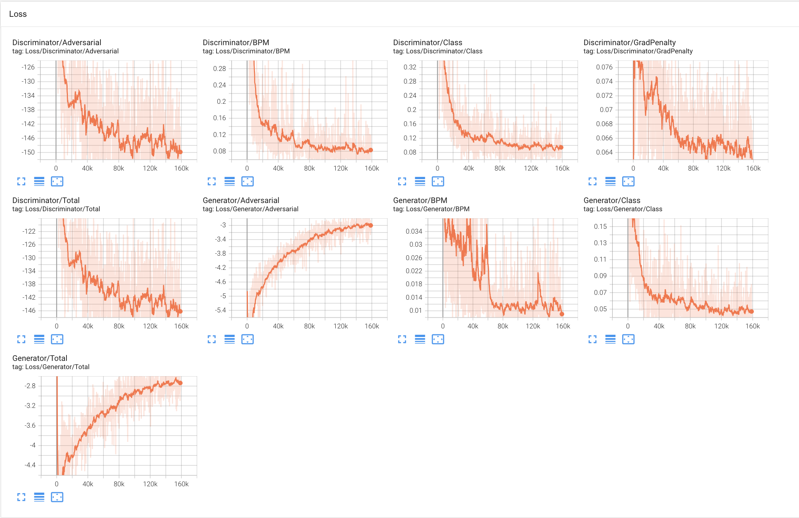

# gdrm


gdrum, short for GAN drum, is a bar-level drum sequencer. Given a parameters like BPM and genre, the system will create a bar in 4-4 that matches your needs. You can increase or decrease variability per bar, force a dramatic change, and even explore mixing genres.

## DEMO video

[](https://youtu.be/T-D1KVIuvjA)

## Installing:
To install the system, clone the repository, and create your python environment in python=3.10. Once in your environment, install project dependencies with `pip install -r requirements.txt`.

## Dataset:
downloaded the [groove dataset](https://magenta.tensorflow.org/datasets/groove#download) and place it in the root of this repository.

This dataset contains many drumming performances in MIDI, with accompanying tempo and genre labels.

## Training:
#### **Preprocessing:**
You need to first pre-process the dataset with the following command. This shouldn't take too long.
```bash
python src/preprocess.py
```
This step iterates through the dataset, splitting and quantising the performances into separate bars, and save them as numpy arrays in a separate folder.

#### **Training:**
Once the dataset is preprocessed, we can begin the training. You can do so like this:
```bash
python src/train.py
```


If you'd like to resume training from some checkpoint, you can run instead:
```bash
python src/train.py --resume_epoch <epoch_num>
```
This will automatically find the checkpoints it needs and load them in.

#### **Monitoring progress:**
You can monitor the progress of the training using tensorboard. You can fire it up using this command:
```bash
tensorboard --logdir=./runs/gdrm_experiment
```


## Playing the sequencer:

```
cd src
fastapi run app.py
```

## The GAN:
The discriminator is trained as a critic, using the wasserstein distance to evaluate it's understanding of the distance between real and fake drum patterns.

The GAN is conditioned on Genre labels via one-hot encoding, and bpm. These parameters are appended to the noise vector the generator recieves, and it's the discriminator's job to correctly guess these labels from the incoming drum patterns. A correct guess results in a positive score for both networks.

To this end, the generator and the discriminator compete when it comes to data provenance, but cooperate for the labels.

We are not necessarily convinced by our choice of hyper-parameters. We do think that there are more optimal settings for the weights of the losses. However, due to lack of time, we were unable to fully test our network.

### Tensorboard
Here you can find the losses that the GAN was subject to. You can see that it could have trained for much longer.



## Acknowledgements:
This project was initially created in the context of the Creative Music Computation course, offered as part of the Master's programme in Sound and Music Computing at the Universitat Pompeu Fabra. This project was created by Andreas Papaeracleous and Fernando Garcia de la Cruz.
